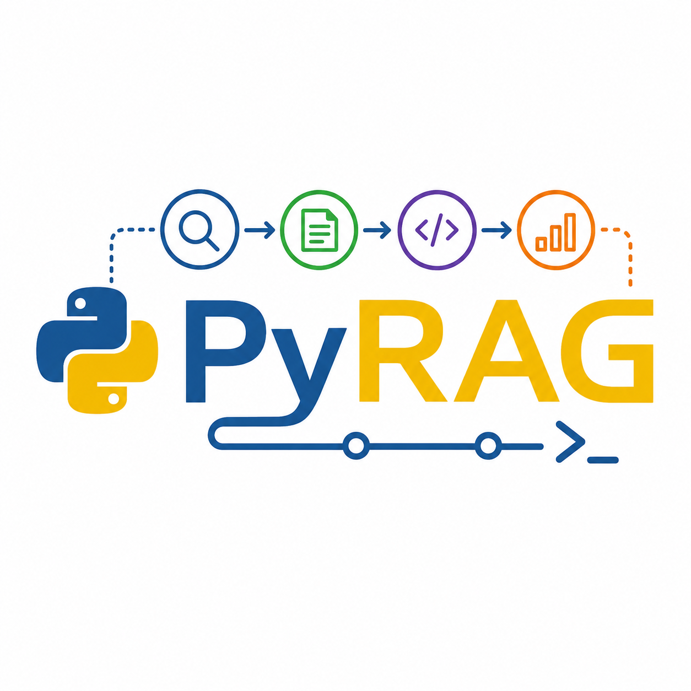
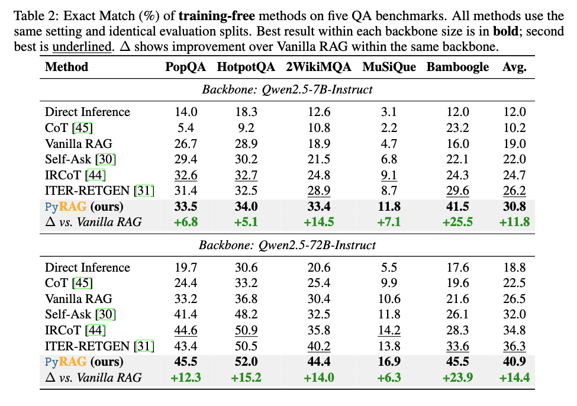
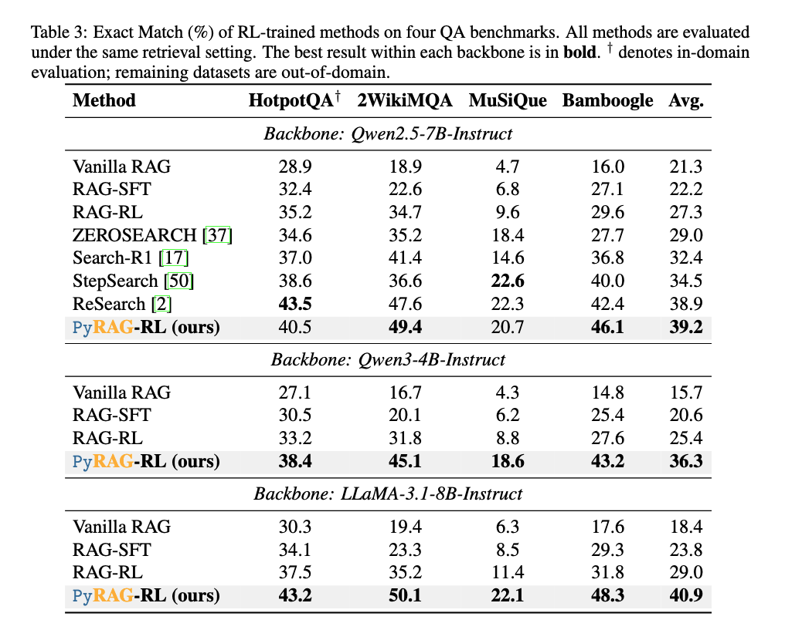

<a name="readme-top"></a>

<p align="center">
    
</p>


<p align="center">
    📑 <a href="https://arxiv.org/pdf/2605.12975"><b>Paper</b></a>&nbsp&nbsp | &nbsp&nbsp🤗 <a href="https://gasolsun36.github.io/PyRAG/">Project Page</a>&nbsp&nbsp | &nbsp&nbsp 🤗 <a href="https://huggingface.co/gasolsun/PyRAG-7b">Models</a> | &nbsp&nbsp 🤗 <a href="https://huggingface.co/datasets/gasolsun/PyRAG_train_test">Data</a> 
</p>

---

## Introduction

**PyRAG** is a framework that reformulates multi-hop Retrieval-Augmented Generation (RAG) as **program synthesis and execution**. Instead of representing reasoning as free-form natural language, PyRAG decomposes a question into atomic sub-queries, synthesizes an executable Python program over two tool primitives — `retrieve(query)` and `answer(query, docs)` — and runs the program step-by-step in a Python interpreter. Intermediate states become explicit variables, runtime exceptions become deterministic repair signals, and the entire reasoning process becomes an inspectable trace.

This design yields two training-free refinement mechanisms as direct byproducts of the executable interface:

- **Compiler-Grounded Self-Repair.** Runtime exceptions (`SyntaxError`, `NameError`, `TypeError`, …) are surfaced back to the Plan Agent as deterministic feedback, replacing unreliable LLM self-reflection.
- **Execution-Driven Adaptive Retrieval.** When an intermediate `answer()` call returns a sentinel (e.g. `"unknown"`), the runner selectively re-executes that step with a boosted top-k, without modifying the rest of the plan.

We provide two variants:

- `PyRAG` — training-free, three-agent pipeline (Decompose / Plan / Answer).
- `PyRAG-RL` — the same pipeline with all three agents GRPO-fine-tuned via [VERL](https://github.com/volcengine/verl) under a curriculum-style shared-parameter schedule.

> <div align="center">
> <b>
> 🚨 PyRAG targets open-domain multi-hop QA. For single-hop factoid queries vanilla RAG is already a strong baseline; PyRAG's gains are largest on compositional multi-hop datasets (e.g. 2WikiMQA, Bamboogle, MuSiQue).
> </b>
> </div>

## Requirements

* Python `>= 3.10`
* `openai >= 1.0`  (used as an OpenAI-compatible client against a local vLLM server)
* `requests`, `pandas`, `pyarrow`, `tqdm`
* `vllm >= 0.5.0` for serving the agent LLMs
* A running dense retrieval server exposing a `POST /retrieve` endpoint (we use E5-base over the Wikipedia 2018 dump, following [Search-R1](https://github.com/PeterGriffinJin/Search-R1)).
* For RL fine-tuning: `verl`, `peft` (LoRA), 1× node of 8×A100 80GB recommended.


> <div align="center">
> <b>
> 🚨 PyRAG executes LLM-generated Python code in-process via <code>exec()</code>. In any non-research deployment you MUST sandbox the interpreter (restricted <code>__builtins__</code>, subprocess isolation, resource limits) and restrict the tool surface to <code>retrieve</code> and <code>answer</code>.
> </b>
> </div>

## Installation

Clone and install in editable mode:

```bash
git clone https://github.com/<your-org>/PyRAG.git
cd PyRAG
pip install -e .
```

If you prefer not to install, you can also run directly from the repo root (`main.py` and `scripts/` use a local `pyrag/` package).

Install evaluation extras (only needed for `scripts/eval.py` and dataset construction):

```bash
pip install -e ".[eval]"   # pulls in pandas, pyarrow, tqdm
```

## Quick Start

PyRAG expects two services running locally before you can issue a query:

1. **One or two vLLM servers** for the agent LLMs (Plan agent + Decompose/Answer agent).
2. **A retrieval server** speaking the `POST /retrieve` JSON protocol on port `8008`.

### 1. Serve the agent LLMs

The Plan Agent benefits substantially from a code-specialized model; the Decompose and Answer Agents use an instruction-tuned model. You can either share one model across all three roles (simpler) or run two vLLM instances (recommended, matches the paper).

```bash
# Plan Agent — code-specialized model, port 8336
CUDA_VISIBLE_DEVICES=0,1 python -m vllm.entrypoints.openai.api_server \
    --model Qwen/Qwen2.5-Coder-7B-Instruct \
    --tensor-parallel-size 2 \
    --port 8336

# Decompose + Answer Agent — instruction model, port 8337
CUDA_VISIBLE_DEVICES=2,3 python -m vllm.entrypoints.openai.api_server \
    --model Qwen/Qwen2.5-7B-Instruct \
    --tensor-parallel-size 2 \
    --port 8337
```

### 2. Serve the retriever

We use the same retrieval setup as [Search-R1](https://github.com/PeterGriffinJin/Search-R1): an E5-base dense retriever over the Wikipedia 2018 dump. Any HTTP server that accepts the following payload and returns the matching JSON will work:

```jsonc
// Request
POST http://127.0.0.1:8008/retrieve
{
  "queries": ["When was Jed Hoyer born?"],
  "topk": 5,
  "return_scores": true
}

// Response
{
  "result": [
    [
      {
        "document": {
          "id": "4664484",
          "contents": "\"Jed Hoyer\"\nJed Hoyer Jed D. Hoyer (born December 7, 1973), is the executive vice-president and general manager of the Chicago Cubs. ..."
        },
        "score": 0.8259738087654114
      },
      // ... topk-1 more hits, sorted by descending score
    ]
  ]
}
```

The outer list of `result` is parallel to `queries` (one entry per query); each inner list contains up to `topk` hits, sorted by descending similarity. When `return_scores` is `false`, each hit is the raw `document` object rather than a `{document, score}` pair.

### 3. Run a query

The entry point is `main.py`. By default it points to the two vLLM ports above and the retriever on `127.0.0.1:8008`:

```bash
export LLM_MODEL="Qwen/Qwen2.5-7B-Instruct"
export LLM_BASE_URL="http://127.0.0.1:8337/v1"
export PLAN_LLM_MODEL="Qwen/Qwen2.5-Coder-7B-Instruct"
export PLAN_LLM_BASE_URL="http://127.0.0.1:8336/v1"
export OUTPUT_DIR="./outputs"

python main.py
```

The default query in `main.py` is the running example from the paper:

> *Who is older, Jed Hoyer or John William Henry II?*

You should see PyRAG (1) decompose the question, (2) synthesize a Python program, (3) execute it step-by-step, and (4) save the generated code, execution trace, and final answer to `./outputs/<timestamp>/`:

```
=== Sub-queries ===
  1. When was Jed Hoyer born?
  2. When was John William Henry II born?

=== Generated Code ===
docs1 = retrieve("When was Jed Hoyer born?")
jed_birth = answer("When was Jed Hoyer born?", docs1)

docs2 = retrieve("When was John William Henry II born?")
john_birth = answer("When was John William Henry II born?", docs2)

final_answer = answer(
    f"Given: Jed Hoyer was born {jed_birth}, "
    f"John William Henry II was born {john_birth}. "
    f"Answer the question: Who is older, Jed Hoyer or John William Henry II?"
)

=== Execution Trace ===
[Step 1] retrieve('When was Jed Hoyer born?', topk=5)
    doc1: Jed Hoyer (Title: Jed Hoyer) Jed Hoyer (born December 7, 1973) is an American ...
[Step 2] answer('When was Jed Hoyer born?')
    → December 7, 1973
[Step 3] retrieve('When was John William Henry II born?', topk=5)
    doc1: John W. Henry (Title: John W. Henry) John William Henry II (born September 13, 1949) ...
[Step 4] answer('When was John William Henry II born?')
    → September 13, 1949
[Step 5] answer('Given: ... Answer the question: ...')
    → John William Henry II

=== Final Answer ===
John William Henry II
```

### 4. Programmatic usage

You can also use PyRAG as a library:

```python
from pyrag import (
    HttpRetrievalAgent,
    OpenAILLM,
    RAGProgramRunner,
    env_enable_thinking,
)

instruct_llm = OpenAILLM(
    model="Qwen/Qwen2.5-7B-Instruct",
    base_url="http://127.0.0.1:8337/v1",
    enable_thinking=env_enable_thinking(),
)
plan_llm = OpenAILLM(
    model="Qwen/Qwen2.5-Coder-7B-Instruct",
    base_url="http://127.0.0.1:8336/v1",
    enable_thinking=env_enable_thinking(),
)
retrieval_agent = HttpRetrievalAgent(host="127.0.0.1", port=8008)

runner = RAGProgramRunner(
    llm=instruct_llm,
    plan_llm=plan_llm,
    retrieval_agent=retrieval_agent,
)

result = runner.run(
    "How old was Virginia Bruce when she starred in Let Freedom Ring?",
    topk=5,
)

print(result["final_answer"])         # → 29
print(result["sub_queries"])          # decomposed atomic queries
print(result["generated_code"])       # the synthesized Python program
print(result["execution_log"])        # full step-by-step trace
print(result["retried_with_topk10"])  # whether adaptive retrieval triggered
```

For offline debugging without a running retrieval server, swap in the `MockRetrievalAgent`:

```python
from pyrag import MockRetrievalAgent
runner = RAGProgramRunner(llm=instruct_llm, retrieval_agent=MockRetrievalAgent())
```

## Performance

We evaluate PyRAG on five open-domain QA benchmarks: **PopQA**, **HotpotQA**, **2WikiMultihopQA**, **MuSiQue**, and **Bamboogle**, with Exact Match (EM) as the primary metric. HotpotQA serves as the in-domain training set for the RL-trained variant; all remaining datasets are evaluated out-of-domain.

### Training-Free Setting

<p align="center">
    
</p>

### RL-Trained Setting

<p align="center">
    
</p>


## Evaluation

### Datasets

Following Search-R1, we train on a mixture of Natural Questions (79,168 single-hop) and HotpotQA (8,757 multi-hop) for a total of 87,925 examples. Evaluation spans five public benchmarks; preprocessed splits and retrieval contexts use the same format as Search-R1.


### Build VERL training data

To produce the four agent-specific parquet datasets used by PyRAG-RL:

```bash
# 1. Generate PyRAG traces on the HotpotQA training split (writes outputs/result.jsonl)
bash scripts/inference_trainset.sh

# 2. Convert traces + NQ + raw HotpotQA into 4 verl-format parquet datasets
bash scripts/build_all_datasets.sh
```

This produces:

```
verl_data/answer_with_docs/train.parquet   # span-QA training data (from NQ ctxs)
verl_data/answer_no_docs/train.parquet     # synthesis training data (from PyRAG traces)
verl_data/plan/train.parquet               # code-generation training data
verl_data/decompose/train.parquet          # sub-query decomposition training data
```

### RL fine-tuning

We use GRPO under the VERL framework with LoRA (rank 64, α=32) and a curriculum-style shared-parameter schedule: the backbone is sequentially specialized into the **Answer**, **Plan**, and **Decompose** roles, with the other two agents frozen at each stage. The order is deliberate — the Answer Agent bounds the end-to-end reward and is trained first; the Plan Agent is trained on top of a calibrated answerer; the Decompose Agent is trained last against two already-strong frozen agents to reduce reward variance.
 
You can refer to PyRAG/verl/utils/reward_score/decompose_reward.py, PyRAG/verl/utils/reward_score/plan_reward.py, PyRAG/verl/utils/reward_score/plan_reward.py three reward function for more details. And we give three sh files for training Answer Agent, Plan Agent and Decomposer Agent.


See **Appendix E.1** of the paper for the full hyperparameter schedule.


### Example output

We provided HotpotQA test result file (based on Qwen2.5-7B-Instruct with training-free-setting) at [https://drive.google.com/file/d/1CBacdD-za8rS-6AVbn0Jazzu2sOUcfxB/view?usp=sharing](https://drive.google.com/file/d/1CBacdD-za8rS-6AVbn0Jazzu2sOUcfxB/view?usp=sharing).

### How to cite


If you interested or inspired by this work, you can cite us by:
```sh
@misc{sun2026retrievalcheapcodeexecutable,
      title={Retrieval is Cheap, Show Me the Code: Executable Multi-Hop Reasoning for Retrieval-Augmented Generation}, 
      author={Jiashuo Sun and Jimeng Shi and Yixuan Xie and Saizhuo Wang and Jash Rajesh Parekh and Pengcheng Jiang and Zhiyi Shi and Jiajun Fan and Qinglong Zheng and Peiran Li and Shaowen Wang and Ge Liu and Jiawei Han},
      year={2026},
      eprint={2605.12975},
      archivePrefix={arXiv},
      primaryClass={cs.AI},
      url={https://arxiv.org/abs/2605.12975}, 
}
```

## Acknowledgements

PyRAG builds on the retrieval setup and evaluation protocol of [Search-R1](https://github.com/PeterGriffinJin/Search-R1), serves agents with [vLLM](https://github.com/vllm-project/vllm), and is RL-fine-tuned with [VERL](https://github.com/volcengine/verl). We thank the maintainers of these projects.

<p align="right" style="font-size: 14px; color: #555; margin-top: 20px;">
    <a href="#readme-top" style="text-decoration: none; color: #007bff; font-weight: bold;">
        ↑ Back to Top ↑
    </a>
</p>
